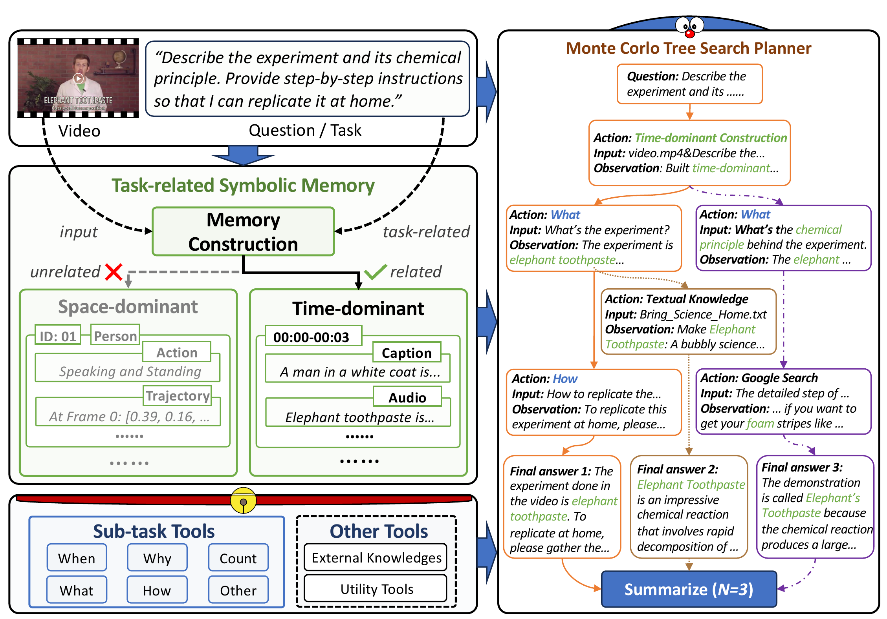

<h1>DoraemonGPT: Toward Understanding Dynamic Scenes with Large Language Models</h1>

    <a href="https://z-x-yang.github.io/" target="_blank">Zongxin Yang</a>&emsp;
    <a href="https://scholar.google.com/citations?user=I1TOdpkAAAAJ&hl=en" target="_blank">Guikun Chen</a>&emsp;
    <a href="https://scholar.google.com/citations?user=B-o8eCwAAAAJ" target="_blank">Xiaodi Li</a>&emsp;
    <a href="https://sites.google.com/view/wenguanwang" target="_blank">Wenguan Wang</a>&emsp;
    <a href="https://scholar.google.com/citations?user=RMSuNFwAAAAJ&hl=zh-CN&oi=ao" target="_blank">Yi Yang✉</a>&emsp;

    ReLER, CCAI, Zhejiang University

     ✉Corresponding Author

    <a href="https://github.com/z-x-yang/DoraemonGPT" target="_blank">arXiv 2024</a>

    
    <em>Overview. Given a video with a question/task, DoraemonGPT first extracts a Task-related Symbolic Memory, which has two types of memory for selection: space-dominant memory based on instances and time-dominant memory based on time frames/clips. The memory can be queried by sub-task tools, which are driven by LLMs with different prompts and generate symbolic language (i.e., SQL sentences) to do different reasoning. Also, other tools for querying external knowledge or utility tools are supported. For planning, DoraemonGPT employs the MCTS Planner to decompose the question into an action sequence by exploring multiple feasible N solutions, which can be further summarized into an informative answer.</em>

The official release of **DoraemonGPT** will be accessible once the paper is formally accepted.
